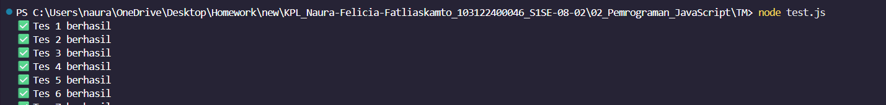

## Tugas Mandiri: Pemrograman JavaScript

**Nama:** Naura Felicia Fatliaskamto

**NIM:** 103122400046

**Kelas:** SE-08-02

## Tugas

Buatlah sebuah fungsi bernama fizzBuzz yang menerima input larik (array) dan mengembalikan deretan bilangan dan "Fizz" untuk kelipatan 2, "Buzz" untuk kelipatan 7, dan "FizzBuzz" untuk kelipatan 14. Beri nama berkas program sebagai tm.js dan taruh di direktori TM.

## Program/kode

Tersedia di [test.js](./test.js) dan [tm.js](./tm.js)

## Output

## Deskripsi

Setelah proses implementasi program selesai, dilakukan tahap pengujian menggunakan Node.js untuk memastikan bahwa setiap fungsi dalam program berjalan dengan baik. Pengujian dilakukan dengan menjalankan file test.js melalui terminal menggunakan perintah node test.js.

Berdasarkan hasil yang ditampilkan pada terminal, seluruh skenario pengujian berhasil dijalankan dengan baik. Hal ini ditunjukkan dengan munculnya pesan “Tes 1 berhasil” hingga “Tes 7 berhasil” yang menandakan bahwa setiap fungsi atau fitur yang diuji telah memberikan hasil sesuai dengan yang diharapkan.