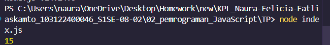

# Tugas pendahuluan : Pemrograman JavaScript

**Nama:** Naura Felicia Fatliaskamto

**NIM:** 103122400046

**Kelas:** SE-08-02 

## Soal

Kamu sudah menulis fungsi mulOfArray. Ujilah dengan Kamu sudah menulis fungsi mulOfArray. Ujilah dengan input [2, 0, 26, 28, -2], dengan output yang seharusnya adalah 1456. Jika kamu menemukan bahwa hasilnya berbeda, bisakah kamu memperbaikinya? Jika kamu menemukan bahwa hasilnya sama, bisakah kamu menjelaskan mengapa demikian?

## Program/kode

Tersedia di [index.js](./index.js)

## output

Array arr1 berisi [2, 0, 26, 28, -2].
Fungsi mulOfArray dibuat untuk menghitung hasil perkalian dari semua angka positif di dalam array tersebut. Angka 0 dan angka negatif diabaikan agar perkalian tetap valid dan tidak menghasilkan 0 atau nilai negatif yang tidak diinginkan. Proses perkalian dimulai dengan nilai awal 1, kemudian setiap elemen array diperiksa secara berurutan.

Jika elemen lebih besar dari 0, elemen tersebut dikalikan ke hasil sementara. Hasil akhir disimpan pada variabel arr1Result, yaitu 1456, sesuai dengan perhitungan 2 * 26 * 28.

## Deskripsi

Pada tahap ini dilakukan proses eksekusi program JavaScript menggunakan Node.js melalui terminal. Program dijalankan dengan perintah node index.js pada direktori proyek yang telah dibuat. Setelah program dijalankan, terminal menampilkan output berupa angka 15.

Output tersebut menunjukkan bahwa program berhasil dijalankan dan menghasilkan hasil sesuai dengan proses atau perhitungan yang telah dibuat pada file index.js. Tampilan hasil pada terminal menandakan bahwa kode JavaScript yang ditulis telah dieksekusi dengan benar oleh Node.js tanpa mengalami error.