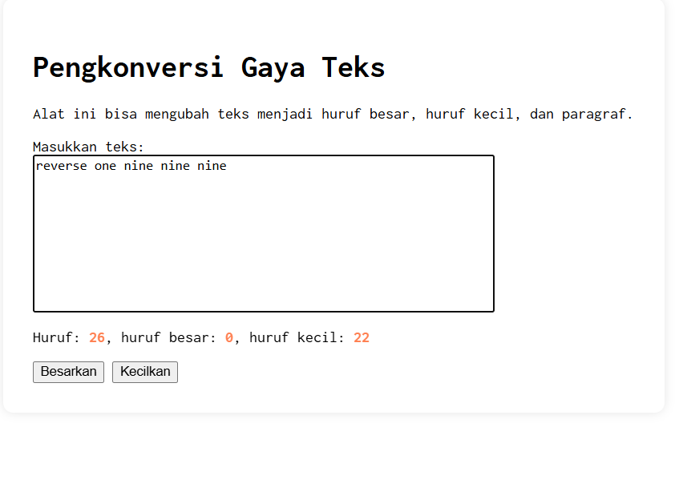
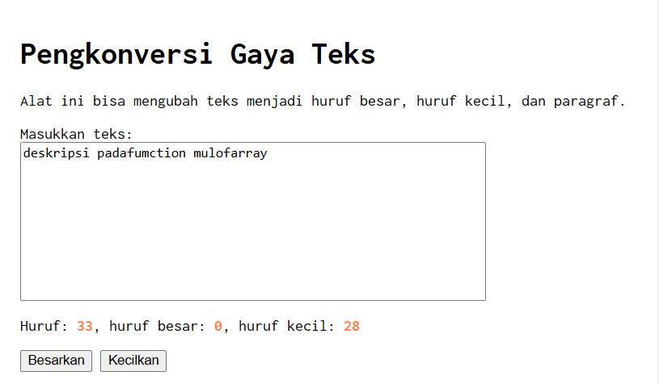

## Tugas pendahuluan: GUI menggunakan HTML dan CSS.

**Nama:** Naura Felicia Fatliaskamto

**NIM:** 103122400046

**Kelas:** SE-08-02

## Soal

Setelah kamu menyelesaikan tugas pendahuluan (bisa buka di atas), terapkanlah fungsi untuk (1) menghitung huruf kecil yang disediakan di #hk, (2) mengubah huruf kecil ke huruf besar ketika pengguna menekan tombol #huruf-besar, dan (3) mengubah huruf besar ke huruf kecil ketika pengguna menekan tombol #huruf-kecil. Untuk nomor 2 dan 3, tampilkan hasilnya di dalam editor-kecil. Kemudian, hapuslah fitur "Paragrafkan" dari alat.

## Kode Sumber

Tersedia di [index.html](./index.html) , [index.js](./index.js) dan , [index.css](./index.css)

## Output
()  

## Deskripsi

**Deskripsi Tugas**

Pada tugas ini dilakukan beberapa perubahan pada alat pengolah teks. Pertama, ditambahkan fungsi untuk menghitung jumlah huruf kecil pada teks yang dimasukkan pengguna dan menampilkannya pada elemen #hk. Kedua, ditambahkan fungsi pada tombol #huruf-besar untuk mengubah semua huruf kecil pada teks menjadi huruf besar. Ketiga, ditambahkan fungsi pada tombol #huruf-kecil untuk mengubah semua huruf besar pada teks menjadi huruf kecil. Selain itu, fitur Paragrafkan yang sebelumnya tersedia pada alat telah dihapus sesuai dengan instruksi tugas.