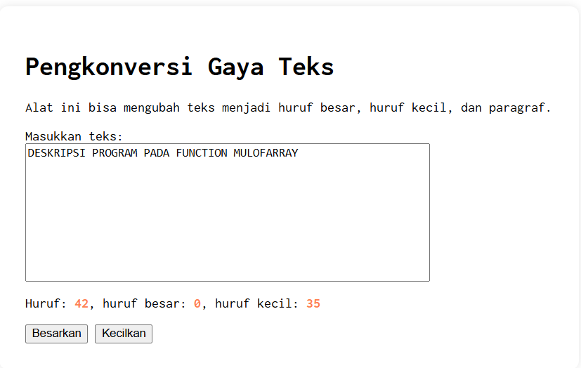

## Tugas pendahuluan: GUI menggunakan HTML dan CSS.

**Nama:** Naura Felicia Fatliaskamto

**NIM:** 103122400046

**Kelas:** SE-08-02

## Soal

Buatlah tata letak laman yang kamu buat berada di tengah seperti di bawah ini, dan juga ubah font-nya dengan Inconsolata dari Google Fonts.

## Kode Sumber

Tersedia di [index.html](./index.html) , [index.js](./index.js) dan , [index.css](./index.css)

## Output

## Deskripsi

dibuat sebuah antarmuka sederhana menggunakan HTML dan CSS yang berfungsi sebagai alat untuk mengonversi gaya teks. Aplikasi ini memungkinkan pengguna untuk mengubah teks yang dimasukkan menjadi huruf besar (uppercase), huruf kecil (lowercase), serta format paragraf. Pada halaman utama terdapat judul “Pengkonversi Gaya Teks” yang menjelaskan fungsi dari alat tersebut. Pengguna dapat memasukkan teks pada area input yang telah disediakan, kemudian memilih tombol aksi seperti Besarkan, Kecilkan, atau Paragrafkan untuk mengubah format teks sesuai kebutuhan.