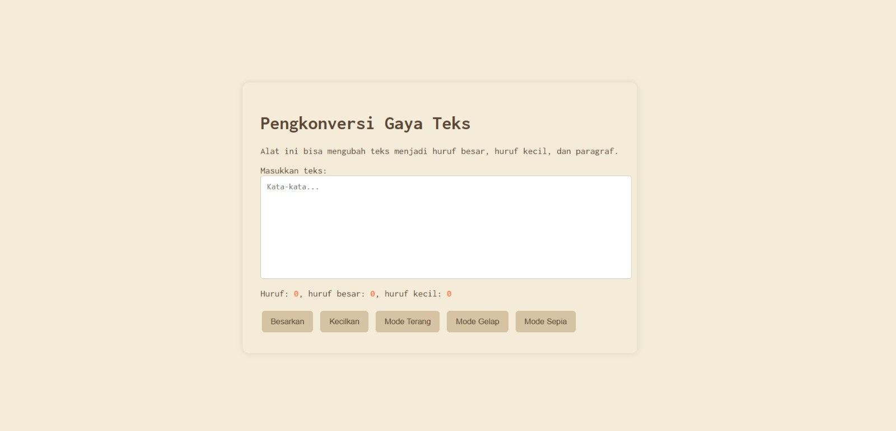

## Tugas pendahuluan: GUI menggunakan HTML dan CSS.

**Nama:** Naura Felicia Fatliaskamto

**NIM:** 103122400046

**Kelas:** SE-08-02

## Soal

Tambahkan mode sepia dengan ketentuan:

Elemen	Warna
Latar belakang	#F4ECD8
Warna teks	#5B4636
Biarkan form tetap warna putih.

Ketentuan lainnya:

Bagian mode-div harus menaungi tiga button: light, dark, dan sepia
Bisa berpindah state secara mulus: sepia menghasilkan sepia-mode, dark menghasilkan dark-mode, dan light menghasilkan light-mode

## Kode Sumber

Tersedia di [TM4.html](./TM4.html) , [TM4.js](./TM4.js) dan , [TM4.css](./TM4.css)

## Output

## Deskripsi

Fitur mode sepia ditambahkan sebagai alternatif tampilan selain mode terang dan gelap untuk meningkatkan kenyamanan visual pengguna. Mode ini menggunakan warna latar belakang #F4ECD8 dan warna teks #5B4636, sehingga memberikan kesan hangat dan nyaman di mata. Implementasi dilakukan dengan menambahkan kelas CSS sepia-mode serta mengatur perpindahan mode menggunakan JavaScript melalui manipulasi classList pada elemen <body>. Disediakan tiga tombol (light, dark, sepia) untuk mengubah tampilan.