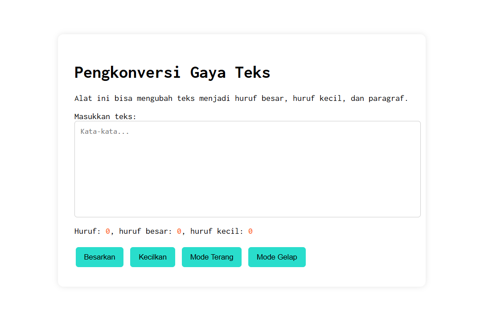
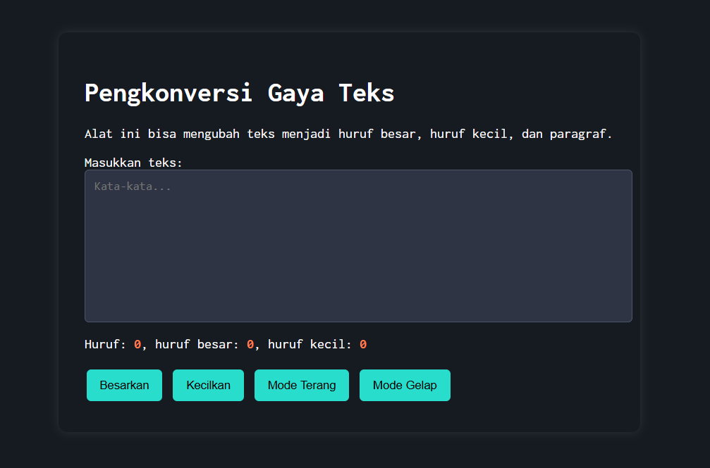

## Tugas pendahuluan: GUI menggunakan HTML dan CSS.

**Nama:** Naura Felicia Fatliaskamto

**NIM:** 103122400046

**Kelas:** SE-08-02

## Soal

Tambahkan mode gelap sekaligus untuk editor-kecil dan tombol-tombolnya. Ketentuan warna untuk latar belakang editor-kecil adalah #2e3443, sementara untuk tombol adalah #29ddcc. Teks untuk tombol tetap mengikuti warna teks sebelumnya.

## Kode Sumber

Tersedia di [test.html](./test.html) , [test.js](./test.js) dan , [test.css](./test.css)

## Output

 ,  

## Deskripsi

Pada sisi antarmuka HTML, disediakan tombol yang terhubung dengan logika JavaScript melalui event listener. Ketika tombol mode diklik, JavaScript bertugas memanipulasi elemen <body> pada dokumen dengan cara menambahkan atau menghapus class spesifik, seperti dark-mode atau light-mode. Perubahan class secara seketika ini memicu transisi aturan desain yang telah didefinisikan di dalam CSS untuk mengambil alih tampilan visual. Saat mode gelap diaktifkan, CSS secara otomatis menimpa gaya bawaan dengan mengubah skema warna secara menyeluruh; dengan ketentuan Ketentuan warna untuk latar belakang editor-kecil adalah #2e3443, sementara untuk tombol adalah #29ddcc.