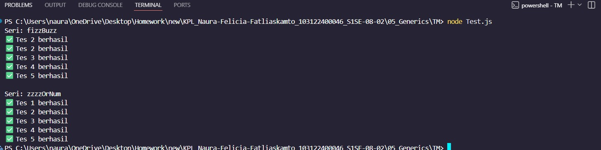

## Tugas pendahuluan: GUI menggunakan HTML dan CSS.

**Nama:** Naura Felicia Fatliaskamto

**NIM:** 103122400046

**Kelas:** SE-08-02

## Soal

Aturan FizzBuzz kali ini adalah:

1. Fungsi fizzBuzz hanya menerima larik yang semua elemennya terdiri dari bilangan bulat dan mengeluarkan larik pula yang bisa jadi bercampur string dan bilangan
2. Fungsi zzzzOrNum hanya menerima sebuah data tunggal berupa bilangan bulat dan mengembalikan "Fizz", "FizzBuzz", "Buzz", atau bilanga bulat sesuai logikanya
3. Kedua fungsi harus ada dan harus disertai JSDoc sesuai tipe data yang disiratkan dari no. 1, no. 2, dan perilaku yang diharapkan di bawah
4. fizzBuzz harus menggunakan fungsi zzzzOrNum di dalamnya

## Kode Sumber

Tersedia di [index.js](./index.js)

## Output

