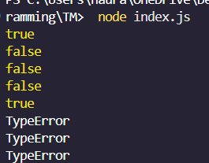

## Tugas pendahuluan: GUI menggunakan HTML dan CSS.

**Nama:** Naura Felicia Fatliaskamto

**NIM:** 103122400046

**Kelas:** SE-08-02

## Soal

Lindungi kode ini dari bilangan-bilangan "fizz buzz"!

Tugasmu adalah membuat fungsi yang menolak bilangan-bilangan kelipatan 3, 5, atau 15, menerima bilangan-bilangan bukan "fizz buzz", dan melempar yang bukan bilangan bulat.

function is_not_fizzbuzz(number) {
  // TODO
}

console.log(is_not_fizzbuzz(1)) // true
console.log(is_not_fizzbuzz(3)) // false
console.log(is_not_fizzbuzz(5)) // false
console.log(is_not_fizzbuzz(30)) // false
console.log(is_not_fizzbuzz(7)) // true
console.log(is_not_fizzbuzz(null)) // Lempar TypeError
console.log(is_not_fizzbuzz(NaN)) // Lempar TypeError
console.log(is_not_fizzbuzz(Infinity)) // Lempar TypeError

## Kode Sumber

Tersedia di [index.js](./index.js)

## Output

## Deskripsi

Tugas ini membahas implementasi fungsi is_not_fizzbuzz menggunakan bahasa pemrograman JavaScript dengan menerapkan konsep defensive programming. Fungsi ini digunakan untuk memeriksa sebuah bilangan bulat berdasarkan aturan FizzBuzz, yaitu menolak bilangan yang merupakan kelipatan 3 atau 5, serta menerima bilangan lainnya.

Selain itu, fungsi juga dilengkapi dengan validasi input untuk memastikan bahwa parameter yang diberikan merupakan bilangan bulat yang valid. Apabila input bukan bilangan bulat atau bukan nilai numerik yang terdefinisi dengan baik (seperti null, NaN, atau Infinity), maka fungsi akan menghasilkan error bertipe TypeError.

Implementasi ini bertujuan untuk melatih pemahaman dalam melakukan validasi input, pengelolaan error, serta penerapan logika kondisional dalam pemrograman yang aman dan sesuai spesifikasi.