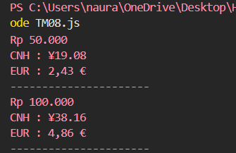

## Tugas pendahuluan: GUI menggunakan HTML dan CSS.

**Nama:** Naura Felicia Fatliaskamto

**NIM:** 103122400046

**Kelas:** SE-08-02

## Soal

Pada tugas ini kamu akan membuat program yang menampilkan kurs rupiah (IDR) terhadap renminbi luar Tiongkok (CNH) dan euro (EUR). Gunakan link API ini untuk mengambil data.

Tantangan

Simpanlah URL API ke dalam .env sebagai BASE_API

Gunakan Intl untuk memformat nilai mata uang dan waktu kamu mengambil data kurs.

Hapus pesan promosi dotenv

## Kode Sumber

Tersedia di [TM8.js](./TM08.js)

## Output

