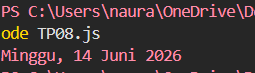

## Tugas pendahuluan: GUI menggunakan HTML dan CSS.

**Nama:** Naura Felicia Fatliaskamto

**NIM:** 103122400046

**Kelas:** SE-08-02

## Soal

Tampilkan tanggal sekarang dengan format seperti ini:

Sabtu, 18 April 2026
Nilai waktu tidak harus sama, asalkan formatnya benar dan bisa tampil di komputer terpisah pada waktu tertentu. Gunakan Intl.DateTimeFormat (bukan string manual).

## Kode Sumber

Tersedia di [TP8.js](./TP08.js)

## Output

