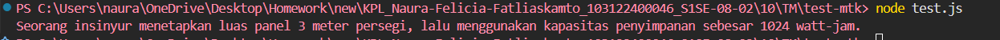

## Tugas pendahuluan: GUI menggunakan HTML dan CSS.

**Nama:** Naura Felicia Fatliaskamto

**NIM:** 103122400046

**Kelas:** SE-08-02

## Soal

Setiap berkas lib hanya memiliki satu fungsi saja.

pangkat.js berisi fungsi pangkat(x, y) yang mengembalikan nilai akhir dari x pangkat y.
bulat.js berisi fungsi bulat(x) yang mengubah bentuk bilangan non-bulat menjadi bulat (mis. -4.25 menjadi -4) .
kuadrat.js berisi fungsi kuadrat(x) yang mengembalikan nilai akar kuadrat 2 dari x.

## Kode Sumber

Tersedia di [main](./Test.js)

## Output

