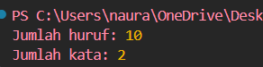

## Tugas pendahuluan: GUI menggunakan HTML dan CSS.

**Nama:** Naura Felicia Fatliaskamto

**NIM:** 103122400046

**Kelas:** SE-08-02

## Soal

Buatlah pustaka JavaScript yang menyediakan utilitas berupa dua fungsi yang menghitung jumlah huruf dan jumlah kata.

Kriteria:

Hanya alfabet A hingga Z yang dihitung (besar dan kecil)
Spasi tidak dihitung
Pustaka bisa diimpor

## Kode Sumber

Tersedia di [TP10.js](./TextUtil.js)

## Output

