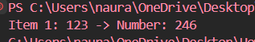

## Tugas pendahuluan: GUI menggunakan HTML dan CSS.

**Nama:** Naura Felicia Fatliaskamto

**NIM:** 103122400046

**Kelas:** SE-08-02

## Soal

Cobalah untuk menangkap kecacatan dalam kode ini

## Kode Sumber

Tersedia di [TP12.js](./TP12.js)

## Output

## Deskripsi
Ditemukan defect pada fungsi processData(). Program memanggil method toLowerCase() terhadap semua data tanpa memeriksa tipe datanya terlebih dahulu. Ketika data bertipe number (456 atau 78.9) maupun boolean (true), method tersebut tidak tersedia sehingga menghasilkan TypeError: data.toLowerCase is not a function. Akibatnya program berhenti sebelum seluruh data diproses.
